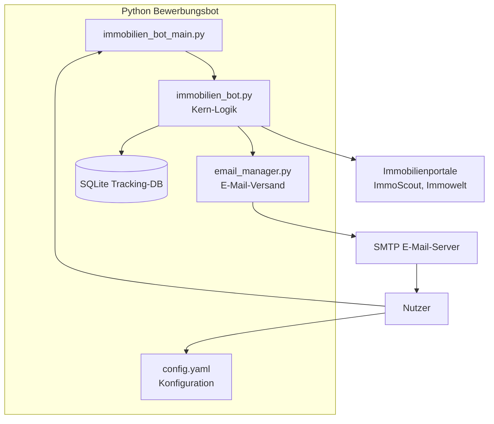

# Komponentendiagramm — Immobilien-Bewerbungsbot

```mermaid
graph TB
    subgraph Python-Bot ["Python Bewerbungsbot"]
        Main[immobilien_bot_main.py]
        BotCore[immobilien_bot.py\nKern-Logik]
        EmailMgr[email_manager.py\nE-Mail-Versand]
        Config[config.yaml\nKonfiguration]
        DB[(SQLite Tracking-DB)]
    end

    Portale[Immobilienportale\nImmoScout, Immowelt]
    SMTP[SMTP E-Mail-Server]
    User[Nutzer]

    User --> Config
    User --> Main
    Main --> BotCore
    BotCore --> Portale
    BotCore --> DB
    BotCore --> EmailMgr
    EmailMgr --> SMTP
    SMTP --> User
```
